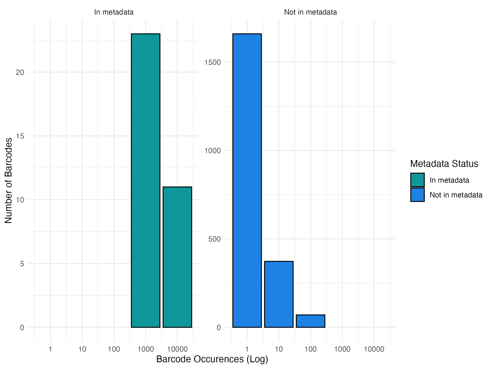
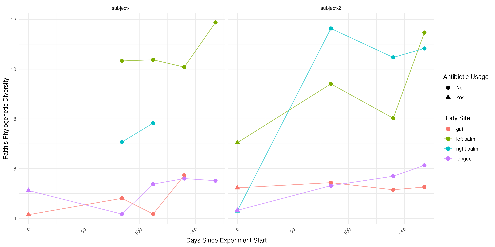
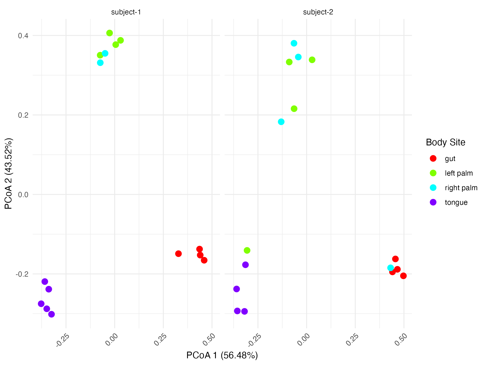

# Step 1: Download dan periksa data mentah

Titik awal untuk sebagian besar analisis metagenomik adalah sekumpulan file [FASTQ](https://en.wikipedia.org/wiki/FASTQ_format#:~:text=FASTQ%20format%20is%20a%20text,single%20ASCII%20character%20for%20brevity.) (yang berukuran sangat besar) dan sebuah file tabel yang berisi informasi mengenai setiap sampel. File tabel ini memuat metadata yang menghubungkan data hasil sekuensing (dalam file FASTQ) dengan informasi eksperimen.

Baik data hasil sekuensing maupun metadata harus diperlakukan sebagai data *read-only*. Keduanya merupakan titik awal analisis dan tidak boleh dimodifikasi.

Untuk menjaga kerapihan struktur folder, data awal ini akan diunduh ke dalam direktori khusus bernama `raw_data`.

Kita akan membuat folder `raw_data` dan mengunduhnya secara langsung ke folder `raw_data` dengan perintah `bash` berikut:

``` bash
# !bash
mkdir raw_data
mkdir -p raw_data/emp-single-end-sequences
wget -O "raw_data/sample-metadata.tsv" "https://data.qiime2.org/2024.5/tutorials/moving-pictures/sample_metadata.tsv"
```

Unduh data *reads* dan *barcode* yang sesuai menggunakan perintah berikut:

``` bash
# !bash
wget -O "raw_data/emp-single-end-sequences/barcodes.fastq.gz" "https://data.qiime2.org/2024.5/tutorials/moving-pictures/emp-single-end-sequences/barcodes.fastq.gz"

wget -O "raw_data/emp-single-end-sequences/sequences.fastq.gz" "https://data.qiime2.org/2024.5/tutorials/moving-pictures/emp-single-end-sequences/sequences.fastq.gz"
```

Kita menyimpan file reads dan barcodes di dalam subfolder `emp-single-end-sequences` yang berada di bawah direktori `raw_data`. Struktur ini digunakan untuk mendukung proses impor data pada tahap QIIME2 selanjutnya.

Sequencer modern memiliki kemampuan untuk membaca sejumlah besar molekul DNA dalam satu kali proses sekuensing. Jumlah reads yang dihasilkan cukup besar untuk memungkinkan analisis terhadap banyak sampel secara bersamaan. Oleh karena itu, sangat umum saat ini untuk menjalankan beberapa sampel dalam satu sesi sekuensing.

Agar reads dari masing-masing sampel dapat dipisahkan setelah proses sekuensing, setiap sampel diberi **barcode** unik. Proses ini dikenal sebagai **multiplexing**, di mana barcode memungkinkan kita mengidentifikasi dan memisahkan reads berdasarkan asal sampelnya.

## Mengamankan *raw data*

Sebelum melanjutkan ke tahap analisis, penting untuk memastikan bahwa file yang telah diunduh memiliki izin akses yang sesuai. Hal ini bertujuan untuk mencegah modifikasi yang tidak disengaja serta memastikan kompatibilitas saat file digunakan dalam pipeline analisis.

Gunakan perintah berikut untuk memeriksa izin akses file di direktori **`raw_data`:**

``` bash
# !bash
ls -l -R raw_data/
```

Ini akan menghasilkan *output* sebagai contoh berikut:

``` bash
## total 16
## -rw-r--r--  1 aguswibowo  staff   215 Aug  8 10:20 README.md
## drwxr-xr-x  4 aguswibowo  staff   128 Aug 14 10:06 emp-single-end-sequences
## -r--r--r--@ 1 aguswibowo  staff  2094 Aug 14 10:05 sample-metadata.tsv
##
## raw_data/emp-single-end-sequences:
## total 56816
## -r--r--r--@ 1 aguswibowo  staff   3783785 Feb 20  2024 barcodes.fastq.gz
## -r--r--r--@ 1 aguswibowo  staff  25303756 Feb 20  2024 sequences.fastq.gz
```

Pastikan bahwa file `barcodes.fastq.gz`, `sequences.fastq.gz`, atau `sample-metadata.tsv` hanya dapat dibaca (read-only) untuk menghindari pengeditan yang tidak disengaja. Gunakan perintah berikut untuk mengatur izin akses file menjadi hanya-baca:

``` bash
# !bash
chmod u-w raw_data/emp-single-end-sequences/*.gz
chmod u-w raw_data/*.tsv
```

## Memeriksa Barcode

Perintah berikut menunjukkan cara untuk melihat beberapa baris pertama dari file FASTQ yang telah dikompresi (gzipped) tanpa perlu mengekstrak seluruh isi file:

``` bash
# !bash
gunzip -c raw_data/emp-single-end-sequences/barcodes.fastq.gz | head
```

Contoh *output:*

``` md
@HWI-EAS440_0386:1:23:17547:1423#0/1
ATGCAGCTCAGT
+
IIIIIIIIIIIH
@HWI-EAS440_0386:1:23:14818:1533#0/1
CCCCTCAGCGGC
+
DDD@D?@B<<+/
@HWI-EAS440_0386:1:23:14401:1629#0/1
GACGAGTCAGTC
```

File ini menggunakan format FASTQ, yang mana setiap barcode direpresentasikan dalam 4 baris. Untuk menghitung jumlah barcode, kita dapat menghitung total baris dalam file lalu membaginya dengan 4. Hal ini dapat dilakukan dengan mudah menggunakan perintah `awk` seperti berikut:

``` bash
# !bash
gunzip -c raw_data/emp-single-end-sequences/barcodes.fastq.gz | awk 'END {print NR/4}'
```

Hasilnya:

``` md
302581
```

**`awk`** adalah perintah sederhana untuk pemrosesan teks. Perintah ini sangat berguna untuk dipelajari karena sudah tersedia secara bawaan di semua sistem berbasis Unix. Berikut adalah penjelasan singkat tentang perintah sebelumnya:

-   Perintah diawali dengan `END` sebagai pola, yang memberi tahu `awk` untuk menunggu hingga akhir file sebelum menjalankan program (yaitu bagian di dalam tanda kurung kurawal `{}`).

-   Program `awk` menggunakan kata kunci `print` untuk mencetak hasil dari `NR/4`.

-   `NR` adalah singkatan dari *Number of Records*, yang berarti jumlah baris. Jadi, `NR/4` akan memberikan total jumlah baris di akhir file dibagi 4.

Penghitungan jumlah entri pada file **`barcodes`** dan **`sequences` s**eharusnya menunjukkan bahwa keduanya memiliki jumlah urutan (sequence) yang sama. Hal ini karena setiap urutan memiliki barcode yang menyertainya.

Pemetaan antara sampel dan barcode terdapat pada file **`sample-metadata.tsv`.** Gunakan kode R berikut untuk melihat lima baris pertama dari file tersebut dan menemukan kolom yang berisi informasi Barcode:

``` r
# r
head(read.delim("raw_data/sample-metadata.tsv", header = TRUE, sep = "\t"), 5)
```

Kode ini akan membaca file metadata dengan pemisah tab (`\t`) dan menampilkan lima baris pertama untuk ditinjau. Perhatikan kolom yang berisi kode barcode, karena kolom inilah yang akan digunakan pada tahap *demultiplexing* nanti.

Output:

| sample.id | barcode-sequence | body.site | year | month | day | subject | reported.antibiotic.usage | days.since.experiment.start |
|--------|--------|--------|--------|--------|--------|--------|--------|--------|
| L1S8 | AGCTGACTAGTC | gut | 2008 | 10 | 28 | subject-1 | Yes | 0 |
| L1S57 | ACACACTATGGC | gut | 2009 | 1 | 20 | subject-1 | No | 84 |
| L1S76 | ACTACGTGTGGT | gut | 2009 | 2 | 17 | subject-1 | No | 112 |
| L1S105 | AGTGCGATGCGT | gut | 2009 | 3 | 17 | subject-1 | No | 140 |

Barcode terdapat pada kolom kedua, sehingga kamu dapat menggunakan perintah di bawah ini untuk menghitung jumlah barcode unik dalam file **`sample-metadata.tsv`.**

Perlu diperhatikan bahwa setiap *sequence* dalam file sekuens bersifat unik, namun banyak barcode akan muncul lebih dari satu kali. Hal ini karena (secara teori) semua *sequence* dari satu sampel seharusnya memiliki barcode yang sama.

Jalankan kode ini untuk melihat berapa banyak barcode unik

``` bash
# !bash
cat raw_data/sample-metadata.tsv | grep -v '^#' | awk '{print $2}' | sort -u | wc -l
```

Penjelasan perintah:

-   `cat raw_data/sample-metadata.tsv` membaca isi file metadata.

-   `grep -v '^#'` mengabaikan baris komentar yang diawali tanda `#`.

-   `awk '{print $2}'` mengekstrak kolom kedua, yaitu kolom barcode.

-   `sort -u` mengurutkan dan menghapus duplikat untuk mendapatkan barcode unik.

-   `wc -l` menghitung jumlah baris, yaitu jumlah barcode unik.

Hasilnya:

``` md
35
```

Ini berarti terdapat 35 barcode unik di dalam file **`sample-metadata.tsv`.**

Kita juga bisa menghitung jumlah barcode unik di dalam file `barcodes.fastq.gz` tanpa perlu mengekstraknya terlebih dahulu, menggunakan perintah berikut:

``` bash
# !bash
gunzip -c raw_data/emp-single-end-sequences/barcodes.fastq.gz | awk 'NR % 4 ==2' | sort | uniq | wc -l
```

Hasilnya:

``` md
2137
```

Artinya, terdapat 2137 barcode unik di dalam file **`barcodes.fastq.gz`.**

Jangan khawatir jika kamu belum sepenuhnya memahami cara kerja perintah tersebut. Berikut beberapa hal penting yang perlu dicatat. Perintah tersebut terdiri dari beberapa bagian yang dihubungkan dengan simbol pipe (`|`), yang digunakan untuk meneruskan output dari satu perintah ke perintah berikutnya. Berikut penjabaran perintahnya:

-   `gunzip -c`: membuka isi file `.gz` tanpa mengekstraknya ke disk.

-   `awk 'NR % 4 == 2'`: memilih baris kedua dari setiap blok 4 baris di file FASTQ, yaitu baris yang berisi barcode.

-   `sort`: mengurutkan semua barcode.

-   `uniq`: menghapus barcode yang duplikat.

-   `wc -l`: menghitung jumlah baris yang tersisa (jumlah barcode unik).

# Step 2:Misteri jumlah barcode yang berlebih

Kita telah mengetahui bahwa jumlah barcode **unik** di dalam file `raw_data/emp-single-end-sequences/barcodes.fastq.gz` **jauh lebih banyak** daripada jumlah barcode yang terdaftar di file `raw_data/sample-metadata.tsv`. Untuk menjelaskan perbedaan ini, kita akan menggunakan pengetahuan tentang **eksplorasi data** serta pemahaman tentang **keterbatasan teknologi sekuensing.**

> 📁 Dataset yang telah kita miliki sejauh ini:
>
> 1.  `raw_data/sample-metadata.tsv`
>
> 2.  `raw_data/emp-single-end-sequences/sequences.fastq.gz`
>
> 3.  `raw_data/emp-single-end-sequences/barcodes.fastq.gz`

Langkah selanjutnya, kita perlu mengekstrak isi dari `barcodes.fastq.gz` ke dalam bentuk tabel, lalu menyimpannya di folder `cache` sebagai file `.txt`. Gunakan perintah bash berikut:

``` bash
# !bash
mkdir cache
gunzip -c raw_data/emp-single-end-sequences/barcodes.fastq.gz | awk 'NR % 4 == 2' > cache/barcodes.txt
```

## Eksplorasi data

Untuk eksplorasi data, kita akan menggunakan paket `tidyverse` karena paket ini dilengkapi dengan berbagai fungsi analisis data, seperti `readr`, `dplyr`, `tidyr`, `ggplot2`, dan lainnya.

**Langkah pertama**: Membaca file `barcodes.txt` dan mengubahnya menjadi objek `tibble`.

``` r
# !r
# Memanggil paket tidyverse
library(tidyverse)
barcodes <- read_table("cache/barcodes.txt", col_names = c("barcode-sequence"), show_col_types = FALSE) # read the barcode.txt then change the heading to "barcode-sequence" and disable in showing column types
head(barcodes, 3)
```

**Selanjutnya**, mari kita baca file `sample-metadata.tsv`. Karena formatnya adalah `.tsv`, kita bisa menggunakan fungsi `read_tsv`:

``` r
# !r
metadata <- read_tsv("raw_data/sample-metadata.tsv", comment = "#", show_col_types = FALSE)
head(metadata, 3)
```

## Menggabungkan Barcode dan Metadata

Sekarang kita sudah memiliki dua variabel: `barcodes` dan `metadata`. Jika kita jalankan kode sebelumnya, kita akan melihat bahwa kolom `barcode-sequence` dalam dataset `barcodes` berisi barcode DNA, yang beberapa di antaranya cocok dengan kolom `barcode-sequence` dalam dataset `metadata`.

Agar analisis menjadi lebih mudah, kita dapat menggabungkan dataset `barcodes` dengan `metadata` menggunakan fungsi `left_join` dari paket `dplyr`.

``` r
# !r
# Joining the barcodes with metadata
joined_data <- barcodes %>% 
  left_join(metadata, by = "barcode-sequence") # mencocokkan baris berdasarkan nilai barcode-sequence
head(joined_data, 5)
nrow(joined_data) # menghitung jumlah baris setelah penggabungan
# write.csv(joined_data, "joineddata.csv") # opsional, jika ingin menyimpan hasil gabungan sebagai file .csv
```

## Menemukan Data yang Tidak Cocok

Menariknya, setelah menjalankan kode di atas, kita dapat melihat bahwa banyak data dari kolom `sample-id` hingga `day-since-experiment-start` ditandai dengan `NA` atau *Not Available*. Hal ini menunjukkan bahwa sebagian data dari dataset `barcodes` **tidak** ditemukan dalam dataset `metadata`.

Kita dapat menghitung berapa banyak data yang cocok menggunakan kode berikut:

``` r
# !r
matching_barcodes <- joined_data %>% 
  filter(!is.na(`sample-id`)) %>% # filtering rows in `joined_data` and checking whether the `sample-id` column is not valued as NA, and only selecting those are not valued as NA
  nrow() # counting rows after filtering 
print(matching_barcodes)
```

**Hasil dari kode ini adalah: `263878`**, yang berarti ada **263.878 data** yang cocok dengan `metadata`dari total **302.581 data**, atau sekitar **87% data yang cocok!**

## Menghitung Frekuensi Barcode Berdasarkan Metadata

Sekarang kita akan menggunakan beberapa perintah tambahan dari paket `tidyverse` untuk menghitung berapa kali setiap barcode muncul dalam data, dengan membaginya menjadi dua grup: **In metadata** dan **Not in metadata**.

``` r
# !r
# Mengelompokkan dan menghitung barcode berdasarkan keberadaan dalam metadata
barcode_counts <- joined_data %>%
  group_by(`barcode-sequence`, `sample-id`) %>% # kelompokkan berdasarkan barcode dan sample
  summarise(count = n()) %>% 
  ungroup() %>%
  mutate(metadata_status = case_when(  
    is.na(`sample-id`) ~ "Not in metadata", # jika sample-id kosong, berarti tidak ada di metadata
    TRUE ~ "In metadata"
  )) %>%
  arrange(desc(count)) # urutkan berdasarkan jumlah barcode (frekuensi)

# Menampilkan 3 baris pertama
head(barcode_counts, 3) 
```

Dengan menjalankan kode di atas, kita akan membuat **dataframe** baru bernama `barcode_counts` (berasal dari `joined_data`) yang memiliki kolom tambahan `metadata_status`, yaitu informasi apakah barcode tersebut **ada atau tidak dalam metadata**.

Dataframe ini kemudian bisa digunakan untuk menganalisis secara lebih dalam berapa banyak barcode yang termasuk ke dalam tiap kategori, berdasarkan jumlah kemunculannya secara logaritmik. Berikut kodenya:

``` r
# !r
# Mengelompokkan barcode berdasarkan skala log frekuensi kemunculannya
barcode_summary <- barcode_counts %>%
  mutate(log_count = floor(log10(count))) %>%     # ubah frekuensi ke skala log (basis 10)
  group_by(metadata_status, log_count) %>%        # kelompokkan berdasarkan status metadata dan log frekuensi
  summarise(total_barcodes = n()) %>%
  ungroup() %>%
  mutate(log_count = 10^log_count)                # ubah kembali ke skala aslinya untuk kemudahan pembacaan

# Menampilkan ringkasan
print(barcode_summary)
```

Hasil dari kode di atas:

``` r
## metadata_status log_count total_barcodes
##  <chr>               <dbl>          <int>
# 1 In metadata          1000             23
# 2 In metadata         10000             11
# 3 Not in metadata         1           1660
# 4 Not in metadata        10            373
# 5 Not in metadata       100             70
```

Seperti yang dapat kita lihat, hasil tersebut menunjukkan jumlah kemunculan barcode berdasarkan frekuensi log-nya. Misalnya, ada 23 barcode berbeda yang masing-masing muncul sekitar 1.000 kali.

## Visualisasi distribusi barcode berdasarkan Metadata

Kita juga bisa membuat grafik histogram yang menarik berdasarkan data `barcode_counts`, seperti yang diringkas dalam `barcode_summary`. Visualisasi ini dibuat dengan bantuan paket `ggplot2` untuk membagi data barcode menjadi dua grup: **In metadata** dan **Not in metadata**, menggunakan fungsi `facet_wrap()`.

``` r
# !r
# ggplot with facet
barcode_distribution_log <- ggplot(barcode_summary, aes(x = `log_count`, y = `total_barcodes`, fill = `metadata_status`)) + 
    geom_bar(stat = "identity", color = "black") +
    scale_x_continuous(trans = "log10") +
    labs(
        x = "Barcode Occurences (Log)",
        y = "Number of Barcodes"
    ) +
    theme_minimal() +
    scale_fill_manual(values = c("In metadata" = "#109799", "Not in metadata" = "#1e81e4")) +
    facet_wrap(~metadata_status, scales = "free_y")

# printing the plot
print(barcode_distribution_log)

# Saving the plot to `figures` folder
ggsave(filename = "barcode_distribution.png", 
       plot = barcode_distribution_facet, 
       path = "figures", 
       width = 8, height = 6, dpi = 300)
```

Dengan menjalankan kode di atas, kita akan membuat grafik histogram dan menyimpannya sebagai file `barcode_distribution.png` ke dalam folder `figures`.

<figure>

{style="background-color:white;" width="1000" height="500"}

## Interpretasi Kemunculan Barcode

Gambar ini menunjukkan distribusi frekuensi barcode berdasarkan keberadaannya di metadata.

Pada sisi kiri (batang hijau), barcode yang **terdapat dalam metadata** memiliki frekuensi kemunculan yang tinggi, yaitu sekitar **1.000 hingga 10.000 kali**. Ini menunjukkan bahwa barcode yang valid memang sering muncul dan digunakan dalam data eksperimen.

Sementara itu, pada sisi kanan (batang biru), barcode yang **tidak ditemukan dalam metadata** didominasi oleh frekuensi rendah: sebagian besar hanya muncul **1 kali**, sebagian kecil muncul **10 atau 100 kali**. Pola ini menunjukkan bahwa banyak barcode tersebut kemungkinan besar merupakan **hasil kesalahan sekuensing**, baik yang bersifat acak (muncul sekali) maupun sistematis (muncul berulang kali).

Secara keseluruhan, grafik ini membantu membedakan antara barcode yang valid dan kemungkinan error dalam data.

# Step 3: Impor barcode dan sekuens ke dalam QIIME *artifact*

Sebagai langkah akhir dari bagian tugas ini, kita akan mengimpor file barcode dan sekuens ke dalam **artifact QIIME**.

Untuk menjaga kerapihan dan menghindari kesalahan dalam mengunggah file besar atau sementara ke GitHub, semua hasil QIIME (termasuk artifacts dan visualisasi) disimpan dalam folder terpisah bernama `qiime`.

**Catatan:** Untuk menjalankan QIIME, kamu perlu [menginstal Anaconda dan menginstal QIIME dalam lingkungan Anaconda.](https://docs.qiime2.org/2024.5/install/native/#install-qiime-2-within-a-conda-environment) Pastikan kamu menginstal versi ***amplicon distribution***. Setelah selesai, kamu bisa mengaktifkan lingkungan QIIME menggunakan perintah berikut:

``` bash
# !bash
# Activating qiime2-amplicon environment in conda
conda activate qiime2-amplicon-2024.5
```

Kemudian jalankan perintah ini untuk mengimpor data:

``` bash
# !bash
mkdir -p qiime
qiime tools import \ 
  --type EMPSingleEndSequences \
  --input-path raw_data/emp-single-end-sequences \
  --output-path qiime/emp-single-end-sequences.qza
```

**Penjelasan Perintah QIIME:**

-   `qiime tools import`: Perintah dari QIIME 2 untuk mengimpor data ke dalam proyek QIIME.

-   `--type`: Menentukan tipe data yang diimpor. Dalam kasus ini, kita mengimpor data sekuens dari format **EMP (Earth Microbiome Project)** bertipe **EMPSingleEndSequences**.

-   `--input-path`: Lokasi folder yang berisi data mentah yang ingin diimpor.

-   `--output-path`: Lokasi dan nama file artifact output yang akan dibuat QIIME (dalam hal ini `emp-single-end-sequences.qza` di dalam folder `qiime`).

## Verifikasi Output Artifact

Setelah perintah dijalankan, kamu bisa memastikan bahwa file artifact berhasil dibuat dengan memeriksa metadata file menggunakan:

``` bash
# !bash
qiime tools peek qiime/emp-single-end-sequences.qza
```

Hasilnya:

``` md
UUID:        791609de-c1a5-4a8f-b8b3-9572ff312a0d
Type:        EMPSingleEndSequences
Data format: EMPSingleEndDirFmt
```

# Step 3 : Demultiplex

> **Catatan:**
>
> 📁 Pada langkah ini, kita akan menggunakan beberapa file dari langkah sebelumnya, yaitu:
>
> 1.  `qiime/emp-single-end-sequences.qza` dan
>
> 2.  `raw_data/sample-metadata.tsv`

Setelah kita mengunduh data dan meninjaunya secara singkat, kini saatnya melakukan proses **demultiplexing**. Proses ini akan menggunakan kolom `barcode-sequence` dari file `sample-metadata.tsv` untuk memisahkan reads berdasarkan sampel.

Gunakan kode di bawah ini untuk menjalankan proses demultiplexing menggunakan fungsi `demux` di QIIME dan memilih mesin `emp-single`. Proses ini memerlukan waktu sekitar satu menit, jadi harap bersabar saat menunggu:

``` bash
# !bash
qiime demux emp-single \
  --i-seqs qiime/emp-single-end-sequences.qza \ 
  --m-barcodes-file raw_data/sample-metadata.tsv \
  --m-barcodes-column barcode-sequence \
  --o-per-sample-sequences qiime/demux.qza \  # saving sample data as .qza
  --o-error-correction-details qiime/demux-details.qza # saving error correction file in qiime
```

## Merangkum hasil multiplex dan visualisasi QIIME

> **Catatan:**
>
> 📁 Kita sekarang memiliki tiga file penting yaitu:
>
> 1.  `qiime/emp-single-end-sequences.qza`,
>
> 2.  `raw_data/sample-metadata.tsv`, dan
>
> 3.  `qiime/demux.qza`

Sampai tahap ini, kita telah menggunakan QIIME untuk membuat *artifact* berupa `.qza`. Artifact ini berguna sebagai bagian dari pipeline, tetapi belum memberikan informasi yang mudah dibaca tanpa bantuan alat visualisasi. Untungnya, QIIME menyediakan fungsi `summarize` untuk membuat objek visualisasi.

Gunakan perintah berikut:

``` bash
# !bash
qiime demux summarize \
  --i-data qiime/demux.qza \
  --o-visualization qiime/demux.qzv # will produce a .qzv file to visualise in qiime viewer
```

File `.qzv` yang dihasilkan dapat dibuka menggunakan [QIIME viewer](https://view.qiime2.org/), yaitu aplikasi berbasis web untuk menampilkan file visualisasi dari QIIME.

> Jika kamu bekerja di RStudio Cloud atau lokal, kamu perlu mengunduh file `.qzv` dan membukanya di [QIIME Viewer](https://view.qiime2.org/).

**Pertanyaan Panduan:**

-   Berapa banyak sampel yang memiliki lebih dari 10.000 sekuens? Kurang dari 10?

-   Pada posisi ke berapa dalam reads skor kualitas median turun di bawah Q30? Q10?

-   Mengingat skor kualitas menggunakan skala Phred, berapa probabilitas Q30? (≈ 0.1%)

-   Berapa jumlah total sekuens yang telah **terdemultiplex**?

-   Bagaimana hasil ini dibandingkan dengan jumlah total semua sekuens sebelum demultiplexing?

-   Apa yang mungkin menjelaskan perbedaan jumlah tersebut?

(Petunjuk: kemungkinan terkait dengan kualitas barcode yang tidak cocok dengan metadata.)

📌 **Total reads hasil demultiplex:** 263.931\

📌 **Total reads awal:** 302.581 → sekitar **87% data berhasil terdemultiplex**

# Step 4: Denoising

## Pemahaman konsep denoising: Menghapus chimera dan kesalahan sekuensing

Komunitas mikroba dalam suatu lingkungan dapat memiliki tingkat keanekaragaman yang sangat tinggi. Dalam satu sampel saja, bisa terdapat ribuan sekuens 16S rRNA yang berbeda, masing-masing mewakili spesies atau strain mikroba yang berbeda-beda. Dalam kondisi ideal, jika data sekuensing yang dihasilkan benar-benar bebas dari kesalahan, kita seharusnya hanya mendeteksi satu sekuens representatif untuk setiap strain mikroba, karena mikroba dari strain yang sama umumnya memiliki sekuens 16S yang hampir identik secara genetik.

Namun, kenyataannya proses sekuensing tidak sepenuhnya akurat. Bahkan platform sekuensing modern seperti Illumina masih dapat menghasilkan kesalahan dalam membaca setiap basa nukleotida. Kesalahan ini dikenal sebagai *base calling errors*, yang bisa menyebabkan variasi palsu dalam data. Selain itu, karena sekuensing 16S berbasis pada amplifikasi (PCR) dari sekuens yang sangat mirip, proses ini juga rentan menghasilkan *chimeric reads*, yaitu sekuens gabungan dari dua atau lebih template DNA yang berbeda. Jika tidak dikenali dan dihapus, *chimera* dapat menambah jumlah sekuens unik secara artifisial.

Kombinasi antara kesalahan pembacaan basa dan *chimera* menyebabkan data mentah menunjukkan jumlah sekuens unik yang jauh lebih tinggi daripada jumlah sekuens yang sebenarnya ada dalam sampel biologis. Untuk mengatasi masalah ini, digunakanlah proses yang disebut **denoising**. Tujuan utama dari *denoising* adalah untuk mengidentifikasi reads yang berasal dari sekuens asli yang sama, mengelompokkannya, dan mewakilinya dengan satu **sekuens representatif** (*representative sequence*). Langkah ini penting untuk mendapatkan estimasi yang lebih akurat tentang komposisi mikroba di dalam sampel.

Dalam proses identifikasi sekuens representatif dari data sekuens mikroba, terdapat dua pendekatan utama yang umum digunakan, yaitu **OTU clustering** dan **error modelling**.

1.  **OTU Clustering (misalnya UPARSE)** Pendekatan ini mengelompokkan sekuens berdasarkan tingkat kemiripan, biasanya dengan ambang batas 97% kesamaan, untuk membentuk ***Operational Taxonomic Units*** **(OTUs)**. UPARSE adalah salah satu algoritma populer yang menerapkan metode ini. OTU clustering mengasumsikan bahwa variasi kecil di antara sekuens (kurang dari 3%) disebabkan oleh kesalahan teknis atau variasi minor, sehingga dikelompokkan ke dalam satu unit taksonomi operasional. Meskipun metode ini telah digunakan secara luas, pendekatan ini bersifat heuristik dan bisa menyatukan sekuens yang secara biologis berbeda, atau sebaliknya, memecah satu jenis menjadi beberapa OTU karena variasi teknis.

2.  **Error Modelling (misalnya DADA2 dan Deblur)**\
    Pendekatan ini menggunakan model statistik untuk **memperkirakan dan mengoreksi kesalahan sekuensing** pada tingkat nukleotida. DADA2 dan Deblur adalah contoh alat yang menerapkan metode ini. Berbeda dengan clustering, pendekatan ini memungkinkan identifikasi **Amplicon Sequence Variants (ASVs)**, yaitu sekuens unik yang benar-benar mewakili variasi biologis tanpa ambang batas kemiripan. Dengan memodelkan probabilitas kesalahan sekuensing, metode ini mampu membedakan antara sekuens yang mirip akibat kesalahan teknis dan sekuens yang berbeda secara biologis. Hasilnya lebih presisi dan cocok untuk studi mikrobioma dengan resolusi tinggi.

Pendekatan *error modelling* kini lebih disukai dibandingkan metode *OTU clustering* dalam hampir semua situasi, karena mampu memberikan resolusi taksonomi yang lebih tinggi dan hasil yang lebih akurat. Untuk tutorial ini, kami memilih menggunakan **Deblur** karena lebih mudah dijalankan dalam lingkungan QIIME. Namun demikian, pendekatan yang digunakan oleh **DADA2** sebenarnya memiliki prinsip kerja yang serupa, yaitu memodelkan kesalahan sekuensing untuk mengidentifikasi *Amplicon Sequence Variants* (ASVs) secara presisi.

## *Quality filtering* sebelum Denoising

Meskipun **Deblur** mempertimbangkan skor kualitas dalam pemrosesannya, sangat disarankan untuk **memangkas sekuens yang kualitasnya sangat rendah** terlebih dahulu. Hal ini dilakukan agar data buruk tidak ikut diproses dan memengaruhi hasil.

Langkah ini menggunakan perintah `qiime quality-filter q-score`, yang secara default akan memangkas semua sekuens yang memiliki skor kualitas di bawah 4 (dalam skala *Phred*).

``` bash
# !bash
qiime quality-filter q-score \
 --i-demux qiime/demux.qza \
 --o-filtered-sequences qiime/demux-filtered.qza \  
 --o-filter-stats qiime/demux-filter-stats.qza  # file hasil statistik penyaringan
```

📌 File `qiime/demux-filtered.qza` inilah yang nantinya digunakan untuk proses downstream (misalnya Deblur).

## Visualisasi Filter Statistik

Gunakan perintah berikut untuk membuat file visualisasi dari hasil quality filter:

``` bash
# !bash
qiime metadata tabulate \
 --m-input-file qiime/demux-filter-stats.qza \
 --o-visualization qiime/demux-filter-stats.qzv # file visualisasi untuk dicek di QIIME viewer
```

> 📁 **File yang seharusnya kamu miliki di langkah Ini:**
>
> 1.  `qiime/emp-single-end-sequences.qza`
>
> 2.  `raw_data/sample-metadata.tsv`
>
> 3.  `qiime/demux.qza`
>
> 4.  `qiime/demux.qzv`
>
> 5.  `qiime/demux-filtered.qza`
>
> 6.  `qiime/demux-filter-stats.qza`
>
> 7.  `qiime/demux-filter-stats.qzv`

Unduh file `demux-filter-stats.qzv` ke komputermu dan buka di [QIIME 2 Viewer](https://view.qiime2.org/) untuk memeriksa filter statistik.

Visualisasi yang dihasilkan dari QIIME hanya berupa **tabel statistik** yang menunjukkan berapa banyak *reads* yang dihapus selama proses penyaringan. Setiap baris dalam tabel merepresentasikan satu sampel, dengan kolom-kolom sebagai berikut:

| Kolom | Keterangan |
|------------------------------------|------------------------------------|
| `sample-id` | ID unik untuk setiap sampel |
| `total-input-reads` | Jumlah total reads mentah sebelum penyaringan |
| `total-retained-reads` | Jumlah reads yang lolos penyaringan |
| `reads-truncated` | Reads yang dipangkas selama proses quality filter |
| `reads-too-short-after-truncation` | Reads yang terlalu pendek setelah dipangkas (dihapus) |
| `reads-exceeding-maximum-ambiguous-bases` | Reads dengan terlalu banyak basa ambigu (misalnya “N”) |

💾 **Ekspor dan Analisis di RStudio**

1.  Klik tombol **Download metadata TSV** di QIIME viewer untuk mengunduh tabel ini.

2.  Simpan file tersebut sebagai: `demux-filter-stats.tsv`

3.  **Upload** file ke proyek RStudio, dan simpan di folder `qiime/`

> 📁 **File yang seharusnya dimiliki saat Ini**
>
> 1.  `qiime/emp-single-end-sequences.qza`
>
> 2.  `raw_data/sample-metadata.tsv`
>
> 3.  `qiime/demux.qza`
>
> 4.  `qiime/demux.qzv`
>
> 5.  `qiime/demux-filtered.qza`
>
> 6.  `qiime/demux-filter-stats.qza`
>
> 7.  `qiime/demux-filter-stats.qzv`
>
> 8.  `qiime/demux-filter-stats.tsv` ✅ (untuk analisis di R)

## Menampilkan proporsi *retained reads* per sampel

Kita bisa menggunakan perintah R atau Bash untuk menghitung proporsi *retained reads* (jumlah reads yang dipertahankan) dari total *input reads* untuk setiap sampel.

✅ **Menggunakan R:**

``` r
# !r
library(tidyverse)
read_props <- read.table("qiime/demux-filter-stats.tsv", header = FALSE, skip = 2) %>%
  mutate(ratio_reads = V3 / V2) %>%       # Membuat kolom rasio dari total_retained_reads / total_input_reads
  select(V1, ratio_reads)                # Menampilkan sample ID dan proporsi
read_props
```

✅ **Atau menggunakan Bash:**

``` bash
# !bash
cat qiime/demux-filter-stats.tsv | tail -n +3 | awk '{print $1, $3/$2}'
```

Output yang dihasilkan akan berupa nama sampel dan proporsi reads yang dipertahankan, seperti berikut:

```         
#### V1     ratio_reads
# 1  L1S105 0.8141093
# 2  L1S140 0.8815979
# 3  L1S208 0.8952104
```

## Menghitung rata-rata proporsi *retained reads* (semua sampel)

🔁 **Menggunakan R:**

``` r
# !r
library(tidyverse)
average_ratio <- read.table("qiime/demux-filter-stats.tsv", header = FALSE, skip = 2) %>%
  summarise(average_ratio = mean(V3 / V2))
average_ratio
```

**🖥️ Atau menggunakan Bash:**

``` bash
# !bash
cat qiime/demux-filter-stats.tsv | tail -n +3 | awk 'BEGIN{av=0}{av+= $3/$2}END{print av/NR}'
```

Perintah ini akan menghitung dan menampilkan **rata-rata proporsi reads yang berhasil dipertahankan** dari semua sampel.

```         
0.706518
```

Proporsi *retained reads* yang sangat rendah dibandingkan dengan rata-rata bisa menjadi indikasi adanya masalah pada suatu sampel. Perlu dicatat bahwa ini hanyalah salah satu dari banyak cara untuk mengidentifikasi sampel yang berpotensi bermasalah. Dalam praktiknya, sebaiknya hindari langsung membuang sampel. Namun, jika suatu sampel menunjukkan hasil yang sangat berbeda dari replikasi lainnya (misalnya sebagai *outlier*), maka metrik kualitas seperti ini dapat digunakan untuk menelusuri kemungkinan sumber masalah—apakah terjadi saat proses sekuensing, atau saat persiapan sampel—dan membantu memutuskan apakah sampel tersebut perlu disingkirkan dari analisis lebih lanjut.

## *Denoising* sekuens

Sekarang jalankan `deblur` untuk mereduksi jumlah sekuens menjadi kumpulan sekuens unik yang merepresentasikan organisme berbeda dalam sampel. Langkah ini juga akan memotong bagian ujung sekuens berdasarkan kualitas dan menghapus *chimera*. Proses ini dilakukan menggunakan perintah:

``` bash
qiime deblur denoise-16S \
  --i-demultiplexed-seqs qiime/demux-filtered.qza \
  --p-trim-length 120 \
  --o-representative-sequences qiime/rep-seqs-deblur.qza \
  --o-table qiime/table-deblur.qza \
  --p-sample-stats \
  --o-stats qiime/deblur-stats.qza
```

📁 **Output dari Proses Denoising**

Setelah proses selesai, akan dihasilkan tiga file output:

1.  `rep-seqs-deblur.qza`\
    Berisi *representative sequences* — yaitu sekuens unik yang mewakili kelompok reads yang sangat mirip dari data mentah. Secara teori, masing-masing sekuens mewakili organisme yang berbeda secara taksonomi dalam sampel.

2.  `table-deblur.qza`\
    Merupakan *feature table* yang mencatat jumlah kemunculan setiap sekuens representatif pada masing-masing sampel.

3.  `deblur-stats.qza`\
    Statistik lengkap dari proses denoising.

## Pemeriksaan output hasil denoising

Gunakan perintah berikut untuk membuat visualisasi dari representative sequences yang dihasilkan oleh Deblur:

``` bash
# !bash
qiime feature-table tabulate-seqs \
  --i-data qiime/rep-seqs-deblur.qza \
  --o-visualization qiime/rep-seqs.qzv
```

**Representative sequences** (*sekuens representatif*) adalah sekuens yang mewakili kumpulan *reads* yang sangat mirip dari data mentah. Secara teori, setiap sekuens representatif seharusnya mencerminkan satu organisme yang berbeda secara taksonomi dalam sampel. Sekuens-sekuens ini disimpan dalam sebuah *artifact* QIIME dengan nama **`rep-seqs-deblur.qza`**.

> 📁 **File yang seharusnya dimiliki pada langkah Ini:**
>
> 1.  `qiime/emp-single-end-sequences.qza`
>
> 2.  `raw_data/sample-metadata.tsv`
>
> 3.  `qiime/demux.qza`, `qiime/demux.qzv`
>
> 4.  `qiime/demux-filtered.qza`
>
> 5.  `qiime/demux-filter-stats.qza`, `qiime/demux-filter-stats.tsv`, `qiime/demux-filter-stats.qzv`
>
> 6.  `qiime/rep-seqs-deblur.qza` ✅
>
> 7.  `qiime/table-deblur.qza` ✅
>
> 8.  `qiime/deblur-stats.qza` ✅
>
> 9.  `qiime/rep-seqs.qzv` ✅

## Meninjau *representative sequences*

Buka file `rep-seqs.qzv` di [QIIME 2 Viewer](https://view.qiime2.org/).\

Viewer ini akan menampilkan daftar sekuens representatif, masing-masing sepanjang 120 basa.

> ❓ *Berapa banyak sekuens representatif yang dihasilkan?*

Jawaban: **485 sekuens**.

Hal ini jauh lebih sedikit dibandingkan jumlah total reads dalam eksperimen, karena:

Tujuan dari **Deblur** adalah menghasilkan kumpulan sekuens representatif dengan tingkat kepercayaan tinggi yang mencerminkan **keanekaragaman mikroba sebenarnya**, bukan jumlah berlebihan akibat kesalahan dan artefak sekuensing.

⚙️ **Mekanisme Reduksi Jumlah Sekuens oleh Deblur:**

1.  **Koreksi Kesalahan dan Denoising:**\
    Deblur dirancang untuk *denoise* data amplicon, menghilangkan error sekuensing dengan cara menggabungkan reads yang kemungkinan berasal dari sekuens asli yang sama namun mengalami error. Ini membuat banyak reads dikonsolidasikan menjadi satu sekuens representatif.

2.  **Penghapusan Chimera:**\
    Deblur mengidentifikasi dan menghapus *chimeric sequences*, yaitu artefak PCR yang tidak mencerminkan sekuens biologis nyata. Ini juga mengurangi jumlah total sekuens.

3.  **Penyaringan Abundansi Rendah:**\
    Sekuens dengan kelimpahan sangat rendah disaring karena kemungkinan besar merupakan noise atau error daripada varian biologis nyata.

4.  **Pengelompokan Sekuens Mirip:**\
    Dalam beberapa kasus, sekuens yang sangat mirip bisa dikelompokkan menjadi satu representative sequence, terutama jika perbedaannya masih dalam batas kesalahan.

5.  **Redundansi Biologis:**\
    Beberapa sekuens dalam data awal mungkin berasal dari organisme yang sama. Deblur mengidentifikasi dan mengurangi redundansi tersebut.

🔬 **Catatan Tambahan**

-   Setiap representative sequence mewakili fragmen gen 16S dari satu organisme.

-   Untuk mengidentifikasi organisme tersebut, kamu bisa melakukan pencocokan (*BLAST*) ke database sekuens—cukup klik sekuens di QIIME viewer.

-   Namun, dalam analisis selanjutnya, kita akan menggunakan **klasifikasi taksonomi otomatis** menggunakan *machine learning classifier*, yang lebih cepat dan akurat.

## Meninjau tabel fitur (`table-deblur.qza`)

Tabel fitur ini mencatat jumlah kemunculan setiap representative sequence di setiap sampel.

Gunakan kode berikut untuk membuat visualisasi dari tabel tersebut:

``` bash
qiime feature-table summarize \
  --i-table qiime/table-deblur.qza \
  --o-visualization qiime/table-deblur.qzv
```

> 📁 **File yang seharusnya dimiliki pada langkah Ini:**
>
> 1.  `qiime/emp-single-end-sequences.qza`
>
> 2.  `raw_data/sample-metadata.tsv`
>
> 3.  `qiime/demux.qza`, `qiime/demux.qzv`
>
> 4.  `qiime/demux-filtered.qza`
>
> 5.  `qiime/demux-filter-stats.qza`, `qiime/demux-filter-stats.tsv`, `qiime/demux-filter-stats.qzv`
>
> 6.  `qiime/rep-seqs-deblur.qza` ✅
>
> 7.  `qiime/table-deblur.qza` ✅
>
> 8.  `qiime/deblur-stats.qza` ✅
>
> 9.  `qiime/rep-seqs.qzv` ✅
>
> 10. `qiime/table-deblur.qzv`✅

## Meninjau visualisasi di QIIME2 viewer

Buka file visualisasi di QIIME2 Viewer. Kamu akan melihat bahwa setiap sampel hanya diberi label berdasarkan kode (misalnya `L5S222`). Akan jauh lebih informatif jika kita bisa **menyertakan metadata tambahan**, seperti lokasi tubuh (*body site*), perlakuan antibiotik, dan sebagainya.

**Menambahkan Metadata ke Visualisasi**

Untuk meningkatkan kualitas visualisasi, kamu perlu membuat ulang file `.qzv` dengan menyertakan **metadata sampel** dari file `raw_data/sample-metadata.tsv`. Gunakan perintah berikut:

``` bash
# !bash
qiime feature-table summarize \
  --i-table qiime/table-deblur.qza \
  --m-sample-metadata-file raw_data/sample-metadata.tsv \
  --o-visualization qiime/table-deblur-metadata.qzv
```

> 📁 **File yang seharusnya dimiliki pada langkah Ini:**
>
> 1.  `qiime/emp-single-end-sequences.qza`
>
> 2.  `raw_data/sample-metadata.tsv`
>
> 3.  `qiime/demux.qza`, `qiime/demux.qzv`
>
> 4.  `qiime/demux-filtered.qza`
>
> 5.  `qiime/demux-filter-stats.qza`, `qiime/demux-filter-stats.tsv`, `qiime/demux-filter-stats.qzv`
>
> 6.  `qiime/rep-seqs-deblur.qza` ✅
>
> 7.  `qiime/table-deblur.qza` ✅
>
> 8.  `qiime/deblur-stats.qza` ✅
>
> 9.  `qiime/rep-seqs.qzv` ✅
>
> 10. `qiime/table-deblur.qzv` ✅
>
> 11. `qiime/table-deblur-metadata.qzv` ✅

## Menentukan sampel dengan kedalaman (*Depth*) tertinggi

Menurut [QIIME2 Viewer](https://view.qiime2.org/), khususnya di tampilan **Interactive Sample Detail**, kamu bisa menggeser indikator *Sampling Depth* ke kanan hingga hanya tersisa satu sampel. Dengan melakukan ini, dapat diketahui bahwa **situs tubuh "right palm"** memiliki **kedalaman tertinggi** (*highest depth*), yang artinya memiliki jumlah sekuens terbanyak setelah penyaringan dan denoising.

# Step 5: Membangun pohon filogenetik dari *representative sequences*

Pada langkah sebelumnya, kita telah menggunakan **Deblur** untuk mereduksi dataset dari jutaan *reads* menjadi beberapa ratus sekuens yang unik. Setiap sekuens tersebut mewakili satu organisme berbeda yang ditemukan dalam sampel.

Pada langkah ini, kita akan memeriksa hubungan **filogenetik** antar sekuens representatif tersebut. Tujuannya adalah untuk mengidentifikasi mana sekuens yang berasal dari organisme yang **berkerabat dekat**, dan mana yang berasal dari **taksa yang lebih jauh**. Informasi ini penting karena akan digunakan dalam perhitungan **metrik keanekaragaman berbasis filogeni** di langkah selanjutnya.

## Menyelaraskan sekuens (*Sequence Alignment*)

Langkah pertama adalah membuat [multiple sequence alignment](https://en.wikipedia.org/wiki/Multiple_sequence_alignment) dari seluruh sekuens representatif. Tujuan dari alignment ini adalah untuk menyelaraskan bagian-bagian dari sekuens yang homolog, sehingga mereka berada pada posisi yang sama di sepanjang alignment.

Untuk melakukan alignment, kita menggunakan program [MAFFT](https://mafft.cbrc.jp/alignment/software/about.html). Namun, kita tidak menjalankan *mafft* secara langsung, melainkan menggunakan perintah `qiime alignment mafft`

``` bash
# !bash
qiime alignment mafft \
  --i-sequences qiime/rep-seqs-deblur.qza \
  --o-alignment qiime/aligned-rep-seqs.qza 
```

> 📁 **File yang seharusnya dimiliki pada langkah Ini:**
>
> 1.  `qiime/emp-single-end-sequences.qza`
>
> 2.  `raw_data/sample-metadata.tsv`
>
> 3.  `qiime/demux.qza`, `qiime/demux.qzv`
>
> 4.  `qiime/demux-filtered.qza`
>
> 5.  `qiime/demux-filter-stats.qza`, `qiime/demux-filter-stats.tsv`, `qiime/demux-filter-stats.qzv`
>
> 6.  `qiime/rep-seqs-deblur.qza` ✅
>
> 7.  `qiime/table-deblur.qza` ✅
>
> 8.  `qiime/deblur-stats.qza` ✅
>
> 9.  `qiime/rep-seqs.qzv` ✅
>
> 10. `qiime/table-deblur.qzv` ✅
>
> 11. `qiime/table-deblur-metadata.qzv` ✅
>
> 12. `qiime/aligned-rep-seqs.qza` ✅

## Meninjau *Sequence Alignment*

QIIME2 tidak menyediakan tampilan langsung untuk *multiple sequence alignment* (MSA), sehingga kita perlu **mengekspor file alignment** dari format `.qza` menjadi format `.fasta` agar bisa diperiksa isinya.

Gunakan perintah berikut:

``` bash
# !bash
mkdir -p qiime/aligned-rep-seqs
qiime tools export --input-path qiime/aligned-rep-seqs.qza --output-path qiime/aligned-rep-seqs
```

> 📁 **File yang seharusnya dimiliki pada langkah Ini:**
>
> 1.  `qiime/emp-single-end-sequences.qza`
>
> 2.  `raw_data/sample-metadata.tsv`
>
> 3.  `qiime/demux.qza`, `qiime/demux.qzv`
>
> 4.  `qiime/demux-filtered.qza`
>
> 5.  `qiime/demux-filter-stats.qza`, `qiime/demux-filter-stats.tsv`, `qiime/demux-filter-stats.qzv`
>
> 6.  `qiime/rep-seqs-deblur.qza` ✅
>
> 7.  `qiime/table-deblur.qza` ✅
>
> 8.  `qiime/deblur-stats.qza` ✅
>
> 9.  `qiime/rep-seqs.qzv` ✅
>
> 10. `qiime/table-deblur.qzv` ✅
>
> 11. `qiime/table-deblur-metadata.qzv` ✅
>
> 12. `qiime/aligned-rep-seqs.qza` ✅
>
> 13. `qiime/aligned-rep-seqs/aligned-dna-sequences.fasta` ✅

**Melihat Isi File *Aligned FASTA***

Untuk melihat sekilas seperti apa isi file alignment `.fasta`, jalankan perintah berikut:

``` bash
head -n 6 qiime/aligned-rep-seqs/aligned-dna-sequences.fasta
```

Hasilnya:

``` bash
## >cb2fe0146e2fbcb101050edb996a0ee2
## TACGTAGGTGGCAAGCGTTATCCGGAATTATTGGGCGTAAAGCG------------CGCGTAGGCGGTTTTTTAAGTCTGAT--GTGAAAGCCCACGGCTCAACCGTG-GAG-GGTCATTGGAAACTGGAAAACTT--
## >ad41fe8f8be5b01c96549309937e3b14
## TACGTAGGGGGCTAGCGTTGTCCGGAATCACTGGGCGTAAAGGG------------TTCGCAGGCGGAAATGCAAGTCAGAT--GTAAAAGGCAGTAGCTTAACTACT-G-T-AAGCATTTGAAACTGCATATCTTG-
## >d29fe3c70564fc0f69f2c03e0d1e5561
## TACGTAGGTCCCGAGCGTTGTCCGGATTTATTGGGCGTAAAGCG------------AGCGCAGGCGGTTAGATAAGTCTGAA--GTTAAAGGCTGTGGCTTAACCATA-GT--ACGCTTTGGAAACTGTTTAACTTG-
```

> Perhatikan tanda `-` (gap) pada sekuens. Ini menandakan bahwa data tersebut merupakan hasil *alignment*, bukan sekuens mentah. Program **MAFFT** menambahkan gap ke sekuens untuk menyelaraskan posisi homolog antar sekuens.

## Melihat alignment dengan tampilan berwarna di R

Pemeriksaan manual terhadap *multiple sequence alignment* akan jauh lebih mudah jika dilakukan dengan **tampilan berwarna**. Terdapat banyak program yang bisa melakukan ini, salah satunya adalah R package **`msaR`**.

Untuk menampilkan *interactive alignment viewer* di R, lakukan langkah berikut:

``` r
# install.packages('msaR')
library(msaR)
msaR("qiime/aligned-rep-seqs/aligned-dna-sequences.fasta")
```

> 📌 File yang digunakan di sini adalah hasil ekspor dari QIIME sebelumnya (`aligned-dna-sequences.fasta`).
>
> 🔍 **Catatan:** Scroll ke kanan untuk melihat seluruh alignment. Panjang alignment sekitar **138 bp**, lebih panjang dari sekuens aslinya (**120 bp**) karena terdapat **gap** (`-`) yang disisipkan selama proses alignment untuk menyelaraskan posisi homolog antar sekuens.

## Masking region yang tidak dapat disejajarkan (*Unalignable*)

Secara umum, alignment yang dihasilkan termasuk **baik**, karena banyak posisi di mana **variasi antar sekuens sangat kecil**. Namun, masih ada beberapa **bagian pendek** di mana hanya sedikit sekuens yang memiliki residu homolog, atau terlalu banyak gap di antara sekuens.

Proses *multiple sequence alignment* memang kompleks dan tidak selalu sempurna. Terutama di daerah dengan **konservasi rendah** (misalnya posisi basa yang sangat bervariasi antar sekuens), penyelarasan bisa menjadi sulit dan rawan kesalahan.

Karena **bagian-bagian yang tidak selaras dengan baik** (*poorly aligned regions*) dapat mengarah pada kesimpulan filogenetik yang menyesatkan, maka bagian-bagian ini perlu di-*masking*—yaitu dengan **menghapusnya dari alignment** sebelum proses pembuatan pohon filogenetik.

Gunakan perintah berikut untuk melakukan masking:

``` bash
# !bash
qiime alignment mask \
  --i-alignment qiime/aligned-rep-seqs.qza \
  --o-masked-alignment qiime/masked-aligned-rep-seqs.qza
```

Sekarang, ekspor file hasil masking yang telah dibuat pada langkah sebelumnya agar bisa divisualisasikan menggunakan **`msaR`** di R. Caranya hampir sama seperti saat mengekspor alignment sebelumnya.

``` bash
# !bash
qiime tools export \
  --input-path qiime/masked-aligned-rep-seqs.qza \
  --output-path qiime/masked-aligned-rep-seqs
```

> Hasil: `qiime/masked-aligned-rep-seqs/aligned-dna-sequences.fasta`

Kemudian, buka file hasil ekspor (`masked-aligned-rep-seqs/aligned-dna-sequences.fasta`) menggunakan R:

``` r
# install.packages('msaR')
library(msaR)
msaR("qiime/masked-aligned-rep-seqs/aligned-dna-sequences.fasta")
```

> 📌 **Catatan:** Kita mungkin **tidak melihat perbedaan mencolok** karena hanya sedikit posisi yang di-*masking*. Namun, jika discroll sampai ke kanan, akan terlihat bahwa panjang alignment kini hanya sekitar **131 bp** — artinya terdapat **7 posisi yang dihapus** akibat masking.

## Membangun pohon filogenetik

Sekarang kita akan menggunakan program [FastTree](http://www.microbesonline.org/fasttree/) untuk menyusun pohon filogenetik berdasarkan *multiple sequence alignment* yang telah kita buat.

Sama seperti `mafft`, kita **tidak menjalankan FastTree secara langsung**, melainkan menggunakan fungsi QIIME:

``` bash
# !bash
qiime phylogeny fasttree \
  --i-alignment qiime/masked-aligned-rep-seqs.qza \
  --o-tree qiime/unrooted-tree.qza
```

## Apa itu *unrooted tree*?

File di atas akan menghasilkan **unrooted tree**, yaitu pohon filogenetik yang **belum memiliki akar**. Pohon ini menunjukkan hubungan dan panjang cabang antar sekuens, namun **tidak menjelaskan arah evolusi** (belum tahu mana yang lebih awal).

Dalam praktiknya, idealnya kita menambahkan *outgroup* untuk menetapkan akar, tapi di studi metagenomik hal ini sering tidak memungkinkan.

🔄 Sebagai gantinya, kita gunakan pendekatan **midpoint rooting**, yang bekerja sebagai berikut:

1.  Pilih dua sekuens dengan panjang cabang total terpanjang.

2.  Tempatkan akar pohon di **titik tengah** antara dua sekuens tersebut.

> **Asumsi implisitnya** adalah bahwa semua panjang cabang mencerminkan waktu evolusi yang setara (laju evolusi konstan).

Gunakan perintah berikut:

``` bash
# !bash
qiime phylogeny midpoint-root \
  --i-tree qiime/unrooted-tree.qza \
  --o-rooted-tree qiime/rooted-tree.qza
```

> **📁 File yang harus dimiliki:**
>
> 1.  Semua file `.qza` dan `.qzv` dari langkah sebelumnya
>
> 2.  ✅ `qiime/masked-aligned-rep-seqs.qza`
>
> 3.  ✅ `qiime/unrooted-tree.qza`
>
> 4.  ✅ `qiime/rooted-tree.qza`

**Visualisasi pohon**

Terakhir, ekspor pohon yang telah berakar agar bisa divisualisasikan atau dibuka di software seperti [iTOL](https://itol.embl.de/):

``` bash
qiime tools export \
  --input-path qiime/rooted-tree.qza \
  --output-path qiime/rooted-tree/
```

File hasil ekspor (`tree.nwk`) dapat dibuka di program penampil pohon seperti [iTOL](https://itol.embl.de/), FigTree, atau ETE toolkit.

Melihat pohon filogenetik dapat memberikan gambaran umum tentang **keragaman taksa bakteri** yang terdapat dalam sampel. Namun, karena **setiap node pada pohon belum diberi label taksonomi**, maka tidak banyak informasi tambahan yang bisa diambil hanya dengan melihat pohon ini saja.

Jika kita memiliki ketertarikan khusus pada kelompok bakteri tertentu, kita bisa membuat pohon yang lebih fokus hanya pada kelompok tersebut, dan mungkin juga menambahkan anotasi visual seperti **warna** atau **ukuran titik** untuk merepresentasikan kelimpahan.

Kita tidak akan melakukan itu dalam tutorial ini, namun perlu diingat bahwa ini merupakan salah satu pendekatan eksploratif yang biasa digunakan oleh peneliti mikrobioma untuk menggali informasi lebih dalam dari data filogenetik.

## Opsional: Visualisasi pohon filogenetik menggunakan **`ggtree`**

Meskipun **iTOL** adalah alat yang sangat baik untuk melihat pohon filogenetik, ada kalanya kamu mungkin ingin membuat **visualisasi pohon berkualitas publikasi** langsung dari **R** atau **RMarkdown** secara *reproducible*.

📦 Paket **`ggtree`** adalah solusi hebat untuk kebutuhan ini. ggtree memungkinkan kamu membuat visualisasi yang sangat fleksibel dan kaya fitur—namun perlu disadari bahwa untuk hasil yang bagus, biasanya dibutuhkan beberapa penyesuaian tambahan.

**📦 Instalasi `ggtree` (dari Bioconductor)**

> ⚠️ **Catatan**: Jalankan perintah ini di *R Console*, **bukan** di RMarkdown karena kamu mungkin perlu menjawab pertanyaan selama instalasi.

**Visualisasi sederhana `.nwk`**

Setelah paket terpasang, kamu bisa membaca file `.nwk` dan memplot pohon dasar menggunakan:

``` r
# !r
library(ggtree)

nwktree <- ape::read.tree("qiime/rooted-tree/tree.nwk")
ggtree(nwktree)
```

📘 **Catatan Tambahan**: `ggtree` mampu melakukan lebih dari sekadar memvisualisasikan pohon—kamu bisa:

-   Menambahkan label taksonomi

-   Mewarnai cabang berdasarkan metadata

-   Menggabungkan data kelimpahan (*abundance*)

-   Mengatur layout pohon (radial, lingkaran, dll)

Jika kamu tertarik mempelajarinya lebih lanjut, bisa lihat buku [ggtree Book.](https://yulab-smu.top/treedata-book/)

# Step 6 : Analisis diversitas

## Menentukan Kedalaman Sampling (*Sampling Depth*)

Salah satu aspek krusial dalam analisis diversitas adalah memastikan bahwa **upaya sampling antar sampel seimbang**.

Secara praktis, ini berarti kita harus menentukan ***cut-off*** **minimum jumlah sekuens per sampel**.

-   Jika suatu sampel memiliki jumlah sekuens **lebih banyak dari cut-off**, maka akan dilakukan *subsampling* (pengambilan acak).

-   Jika jumlah sekuens **kurang dari cut-off**, sampel akan **dikeluarkan dari analisis**.

> ⚠️ **Catatan Penting:**\
> Jika nilai cut-off terlalu rendah → akan kehilangan sekuens berabundansi rendah.\
> Jika terlalu tinggi → banyak sampel akan dikeluarkan. (Misalnya cut-off 1300 bisa menghilangkan terlalu banyak sampel.)

Gunakan [QIIME viewer](https://view.qiime2.org/) untuk membuka file `qiime/table-deblur.qzv`, lalu gunakan tampilan *interactive sample detail* untuk memilih nilai **sampling depth** yang tepat.

👉 Gunakan aturan umum: **usahakan tidak menghilangkan lebih dari beberapa sampel saja.**

Jalankan perintah berikut untuk menghitung metrik alpha dan beta diversity:

``` bash
# !bash
qiime diversity core-metrics-phylogenetic \
  --i-phylogeny qiime/rooted-tree.qza \
  --i-table qiime/table-deblur.qza \
  --p-sampling-depth 700 \
  --m-metadata-file raw_data/sample-metadata.tsv \
  --output-dir qiime/core-metrics-results
```

> Gantilah nilai `700` dengan nilai kedalaman yang telah kamu pilih berdasarkan visualisasi sebelumnya.

Folder `qiime/core-metrics-results` akan berisi banyak file hasil analisis, termasuk:

1.  Metrik **Alpha diversity**: Shannon, Observed OTUs, Evenness

2.  Metrik **Beta diversity**: Bray-Curtis, UniFrac, dsb

Beberapa file `.qzv` mungkin sudah tersedia dan bisa langsung divisualisasikan menggunakan QIIME Viewer

## **Melakukan analisis statistik:** Uji signifikansi *alpha diversity*

Sekarang kita akan menggunakan plugin `alpha-group-significance` di QIIME untuk melakukan **uji statistik** antara **Faith’s phylogenetic diversity** dan **metadata sampel**.

Uji yang digunakan adalah [Kruskal-Wallis,](https://en.wikipedia.org/wiki/Kruskal–Wallis_one-way_analysis_of_variance)yaitu versi non-parametrik dari ANOVA satu arah. Uji ini digunakan untuk mengevaluasi apakah sampel yang dikelompokkan berdasarkan suatu faktor (misalnya *body site*) berasal dari **distribusi yang sama** (*hipotesis nol*).

> Singkatnya: uji ini menjawab pertanyaan "apakah suatu faktor kelompok memiliki pengaruh yang signifikan terhadap alpha diversity?"

Jalankan perintah qiime berikut:

``` bash
# !bash
qiime diversity alpha-group-significance \
  --i-alpha-diversity qiime/core-metrics-results/faith_pd_vector.qza \
  --m-metadata-file raw_data/sample-metadata.tsv \
  --o-visualization qiime/core-metrics-results/faith-pd-group-significance.qzv
```

**🔍 Interpretasi Hasil**

Buka file `.qzv` tersebut di QIIME Viewer dan lihat hasil visualisasinya.

🧾 **Faktor eksperimental** yang secara signifikan berhubungan dengan *Faith’s phylogenetic diversity* (p-value \< 0.05) adalah:

-   **Penggunaan antibiotik**

-   **Lokasi tubuh (body sites)**

Ini menunjukkan bahwa keberagaman mikroba secara filogenetik dapat dipengaruhi oleh faktor-faktor biologis dan lingkungan tertentu.

## Membuat kurva *Alpha Rarefaction*

Saat menghitung metrik diversitas, kita harus memilih nilai untuk parameter `--p-max-depth`. Parameter ini memastikan bahwa semua sampel dianalisis dengan **kedalaman sekuensing yang setara** (jumlah sekuens per sampel).

🎯 Dalam langkah ini, kita ingin melihat **bagaimana diversitas alpha berubah seiring meningkatnya kedalaman sampling**. Secara intuitif, makin dalam kita menyampling, makin banyak jenis mikroba yang kita temukan — **hingga titik tertentu**, di mana seluruh keberagaman biologis sebenarnya sudah terukur.

``` bash
qiime diversity alpha-rarefaction \
  --i-table qiime/table-deblur.qza \
  --i-phylogeny qiime/rooted-tree.qza \
  --p-max-depth 700 \
  --m-metadata-file raw_data/sample-metadata.tsv \
  --o-visualization qiime/alpha-rarefaction.qzv
```

> Gunakan nilai `--p-max-depth` yang sama seperti nilai cut-off sebelumnya (misalnya: 700 atau 1300)

## Visualisasi kurva rarefaksi

Buka file `alpha-rarefaction.qzv` menggunakan QIIME viewer. Secara default, kurva akan menampilkan data berdasarkan setiap barcode sequence (sampel individu). Set metrik ke **`observed-features`** (ASV yang terdeteksi) untuk melihat:

-   📈 **Kenaikan tajam di sisi kiri grafik** → Artinya, penambahan sedikit depth langsung menghasilkan banyak fitur baru (ASVs)

-   📊 **Perbedaan antar sampel yang cukup besar** → Beberapa sampel mencapai plateau lebih cepat, sementara yang lain terus naik meskipun pada depth tinggi

Misalnya, metrik seperti ***Shannon diversity*** biasanya mencapai ***plateau*** **lebih cepat** dibanding *observed features.*

## Klasifikasi taksonomi sekuen 16S

Salah satu **keunggulan utama** dari analisis gen 16S adalah bahwa gen ini telah digunakan secara luas di berbagai studi sebelumnya. Banyak mikroba sudah memiliki data taksonomi berbasis gen 16S. Dengan mencocokkan sekuens hasil eksperimen kita dengan **database taksonomi referensi**, kita bisa memperkirakan identitas mikroba yang ditemukan.

**Unduh file classifier**

Unduh classifier yang sesuai dengan versi `sklearn` yang dimilik. Misalnya, jika menggunakan sklearn v1.4.2:

``` bash
# !bash
wget "https://data.qiime2.org/classifiers/sklearn-1.4.2/greengenes2/2024.09.backbone.full-length.nb.sklearn-1.4.2.qza" -O "qiime/greengenes2/2024-09-backbone-full-length-nb-sklearn-1-4-2.qza"
```

**Jalankan klasifikasi taksonomi**

Gunakan plugin `feature-classifier classify-sklearn` untuk mengklasifikasikan sekuens ke taksonomi:

``` bash
# !bash
qiime feature-classifier classify-sklearn \
  --i-classifier qiime/qiime/greengenes2/2024-09-backbone-full-length-nb-sklearn-1-4-2.qza \
  --i-reads qiime/rep-seqs-deblur.qza \
  --o-classification qiime/taxonomy.qza
```

**📊 Visualisasi taksonomi (Barplot)**

Buat visualisasi batang taksonomi berdasarkan klasifikasi yang baru dibuat:

``` bash
# !bash
qiime taxa barplot \
  --i-table qiime/table-deblur.qza \
  --i-taxonomy qiime/taxonomy.qza \
  --m-metadata-file raw_data/sample-metadata.tsv \
  --o-visualization qiime/taxa-bar-plots.qzv
```

📁 Buka file `taxa-bar-plots.qzv` menggunakan [qiime viewer](https://view.qiime2.org/)

> Apa kelompok taksonomi dominan (Level 2: Phylum) pada saluran pencernaan manusia? Bagaimana perbedaannya dengan lokasi tubuh lain?
>
> ✅ Jawaban: **Bacteroidetes** biasanya mendominasi di usus, sedangkan kulit atau mulut bisa didominasi oleh *Firmicutes* atau *Actinobacteria*.

------------------------------------------------------------------------

Ayo kita analisis alpha dan beta diversity!

## **Alpha diversity**

Gunakan perintah `qiime tools export` untuk mengekspor hasil alpha diversity *Faith’s Phylogenetic Diversity* dari file `.qza` menjadi file `.tsv` yang bisa dibaca di R:

``` bash
# !bash
qiime tools export --input-path qiime/core-metrics-results/faith_pd_vector.qza --output-path qiime/faith_pd
```

Setelah perintah ini dijalankan, akan dihasilkan file baru:: `qiime/faith_pd/alpha-diversity.tsv`

**Membuat Visualisasi Faith's PD di R**

Berikut adalah langkah-langkah untuk memvisualisasikan data *Faith’s Phylogenetic Diversity* berdasarkan informasi dari metadata (misalnya: lokasi tubuh, penggunaan antibiotik, dsb).

``` r
# Load the tidyverse package which includes functions for data manipulation and plotting
library(tidyverse)

# Reading the faith_pd/alpha-diversity.tsv and metadata and showing the first 5 rows, and changing name columns both in alha-diversity data and metadata for 'sample-id'
alpha_diversity <- read_tsv("qiime/faith_pd/alpha-diversity.tsv", show_col_types = FALSE) %>% # nolint
                        rename(Sample = '#SampleID')
metadata <- read_tsv("raw_data/sample-metadata.tsv", show_col_types = FALSE, comment = '#q') %>% # nolint
                rename(Sample = 'sample-id')
head(alpha_diversity, 5) # nolint
head(metadata, 5)

# Joining sample metadata and alpha-diversity data
merged_data <- metadata %>% 
  left_join(alpha_diversity, by = "Sample")

# Converting relevant columns to appropriate data types and checking for NA values in the faith_pd column
merged_data <- merged_data %>% 
  mutate(across(c(year, month, day), as.numeric),
         faith_pd = as.numeric(faith_pd))
sum(is.na(merged_data$faith_pd))

# Cleaning data: Removing NA values in faith_pd and ensuring proper data types
merged_data_clean <- merged_data %>% 
  filter(!is.na(faith_pd)) %>%
  mutate(faith_pd = as.numeric(faith_pd),
         `days-since-experiment-start` = as.numeric(`days-since-experiment-start`))

# Plot: Alpha diversity based on body site, faceted by subject and colored by antibiotic usage
ggplot(merged_data_clean, aes(x = `body-site`, y = faith_pd, fill = `reported-antibiotic-usage`)) +
  geom_boxplot(outlier.shape = NA, alpha = 0.7) +
  geom_jitter(position = position_jitter(width = 0.2), alpha = 0.5) +
  facet_wrap(~subject, scales = "free") +  # Facet by subject
  labs(x = "Body Site",
       y = "Alpha Diversity",
       fill = "Antibiotic Usage") +
  theme_minimal() +
  theme(axis.text.x = element_text(angle = 45, hjust = 1))

# Plot: Alpha diversity over time, faceted by subject and colored by body site
ggplot(merged_data_clean, aes(x = `days-since-experiment-start`, y = faith_pd, color = `body-site`)) +
  geom_line(aes(group = interaction(subject, `body-site`)), alpha = 0.7) +  # Line plot for each body site per subject
  geom_point(aes(shape = `reported-antibiotic-usage`), size = 3) +  # Points with shape indicating antibiotic usage
  facet_wrap(~subject) +  # Facet by subject
  labs(x = "Days Since Experiment Start",
       y = "Alpha Diversity",
       color = "Body Site",
       shape = "Antibiotic Usage") +
  theme_minimal() +
  theme(axis.text.x = element_text(angle = 45, hjust = 1))
```

{style="background-color:white;" width="1000"}

**Alpha diversity** mengukur keanekaragaman mikroba dalam satu komunitas, mencerminkan baik kekayaan spesies maupun keseragaman relatif, serta distribusi taksonominya. Berdasarkan analisis alpha diversity (Faith’s Phylogenetic Diversity), komunitas mikroba di berbagai lokasi tubuh menunjukkan respons yang berbeda terhadap pemberian antibiotik pada dua subjek yang diamati.

Pada **Subjek 1** (panel kiri), telapak tangan kiri dan kanan memiliki keanekaragaman mikroba yang lebih tinggi dibandingkan usus dan lidah, yang menunjukkan variasi yang lebih moderat. Secara khusus, telapak tangan kanan dan usus menunjukkan peningkatan signifikan dalam keanekaragaman mikroba, meskipun pada awal percobaan kedua lokasi ini memiliki keanekaragaman terendah. Hal ini mengindikasikan bahwa pemberian antibiotik mungkin hanya berdampak minimal terhadap komunitas mikroba di kedua lokasi tersebut. Sebaliknya, keanekaragaman mikroba pada lidah mengalami penurunan awal selama 75 hari pertama, diikuti oleh pemulihan bertahap, yang menunjukkan adanya dampak negatif antibiotik terhadap mikrobioma oral, namun dengan potensi pemulihan seiring waktu.

Sementara itu, pada **Subjek 2** (panel kanan), telapak tangan kiri dan kanan mempertahankan tingkat keanekaragaman mikroba yang lebih tinggi dibandingkan dua lokasi tubuh lainnya sepanjang durasi percobaan. Secara khusus, telapak tangan kiri menunjukkan lonjakan tajam dalam keanekaragaman mendekati Hari ke-150, yang mungkin mencerminkan perkembangan atau pemulihan komunitas mikroba yang signifikan. Usus dan lidah juga menunjukkan tren peningkatan keanekaragaman yang lebih bertahap pada Subjek 2.

## **Beta Diversity**

Kode di bawah ini menggunakan perintah `qiime tools export` untuk mengekspor matriks jarak **Jaccard**. Ekspor ini memungkinkan kita untuk menggunakan `tidyverse` dalam R untuk membuat berbagai plot berdasarkan jarak Jaccard tersebut.

``` bash
# !bash
qiime tools export --input-path qiime/core-metrics-results/jaccard_distance_matrix.qza --output-path qiime/jaccard
```

Kita akan memulai dengan matriks jarak **Jaccard** mentah, yang disimpan di `qiime/jaccard/distance/distance-matrix.tsv`

``` r
# !R
# Membaca data Jaccard dan mengonversi baris pertama menjadi nama baris
beta_diversity <- read_tsv("qiime/jaccard/distance-matrix.tsv", show_col_types = FALSE) %>%
  column_to_rownames("...1") %>%
  as.matrix()
head(beta_diversity)

# Menampilkan plot heatmap sederhana
heatmap(beta_diversity)
```

Membuat heatmap memungkinkan kita untuk melihat bahwa tampaknya terdapat setidaknya tiga blok sampel terpisah, masing-masing terdiri dari sampel-sampel yang cukup mirip satu sama lain (ditunjukkan oleh warna yang lebih gelap).

Meskipun pembuatan heatmap ini cukup mudah, namun agak sulit untuk memperluasnya. Misalnya, kita ingin menambahkan label sesuai metadata agar kita dapat menemukan apa yang menyebabkan terbentuknya kelompok-kelompok tersebut.

Heatmap adalah salah satu jenis plot yang tidak didukung langsung oleh `ggplot2`. Salah satu alternatif yang sangat bagus untuk membuat heatmap berkualitas tinggi adalah paket **ComplexHeatmap** dari **Bioconductor**. Namun, karena penggunaannya cukup rumit dan hanya berguna untuk heatmap, kita tidak akan membahasnya di sini.

**Membentuk pohon dari setiap klaster**

Representasi alami dari matriks jarak adalah **pohon berbasis klaster hierarkis**. Fungsi `hclust` di R bisa digunakan untuk melakukan ini. Namun sebelumnya, matriks jarak perlu dikonversi menjadi objek R khusus bertipe `dist`.

``` r
# !R
beta_dist <- dist(beta_diversity)
beta_clust <- hclust(beta_dist)
```

Cara terbaik untuk memvisualisasikan pohon ini di R adalah menggunakan paket `ggtree`, namun kita juga bisa menggunakan fungsi `plot()` dari base-R untuk membuat plot sederhana:

``` r
# !R
plot(beta_clust)
```

**Menambahkan metadata ke dendrogram**

Untuk menggali lebih lanjut, kita butuh metadata. Metadata yang sudah kita siapkan sebelumnya untuk analisis alpha diversity juga bisa digunakan di sini, agar label klaster dapat ditampilkan berdasarkan `body site`. Meski bisa dilakukan di base-R, hasilnya cenderung kurang fleksibel dibandingkan `ggplot`.

``` r
# !R
sample_body_sites <- metadata $ `body-site`
names(sample_body_sites) <- metadata $ Sample

plot(beta_clust, labels = sample_body_sites[beta_clust $ labels])
```

**Multidimensional Scaling (MDS)**

Salah satu cara untuk **memvisualisasikan beta diversity** adalah menggunakan plot MDS. Analisis MDS memungkinkan kita untuk melihat bagaimana kesamaan atau perbedaan antara sampel berdasarkan matriks jarak, seperti Jaccard.

``` r
mds <- cmdscale(as.dist(beta_diversity), k = 2) %>%
    as.data.frame() %>%
    rownames_to_column("id")

ggplot(mds) + geom_point(aes(x = V1, y = V2))

# Adding meta data
mds_metadata <- mds %>%
    left_join(metadata, by = "Sample")

mds_metadata <- mds_metadata %>%
    mutate(day = as.factor(day))

head(mds_metadata, 5)


# Mds plot
# Perform MDS analysis
mds <- cmdscale(dist(mds_metadata %>% select(V1, V2)), eig = TRUE)

# Calculate percentage variance explained by each dimension
mds_variance <- mds$eig / sum(mds$eig) * 100
mds_percent1 <- round(mds_variance[1], 2)
mds_percent2 <- round(mds_variance[2], 2)

# MDS plot with percentage explained
ggplot(mds_metadata, aes(x = V1, y = V2, color = `body-site`)) +
    geom_point(size = 3) +
    facet_wrap(~subject) +
    labs(x = paste0("MDS Dimension 1 (", mds_percent1, "%)"),
         y = paste0("MDS Dimension 2 (", mds_percent2, "%)")) +
    scale_color_manual(values = rainbow(length(unique(mds_metadata $ `body-site`)))) +
    theme_minimal() +
    theme(axis.text.x = element_text(angle = 45, hjust = 1))
```

{style="background-color:white;" width="1000" height="500"}

**Analisis beta diversity menunjukkan perbedaan signifikan dalam komposisi taksonomi antar lokasi tubuh** (PERMANOVA: *p* \< 0,05) berdasarkan indeks Jaccard. **Koordinat utama pertama (PCoA 1)** menjelaskan **54,87% variasi**, yang secara efektif memisahkan sampel usus dari lokasi tubuh lainnya. **Koordinat utama kedua (PCoA 2)** menjelaskan **45,13% variasi**, terutama membedakan sampel telapak tangan dari lokasi lainnya, di mana sampel telapak tangan kiri dan kanan dari kedua subjek berkelompok bersama. Selain itu, **sampel dari lidah** pada kedua subjek juga berkelompok rapat di kuadran kiri atas, menunjukkan **komunitas mikroba yang sangat konsisten antar individu** untuk lokasi tubuh ini.
